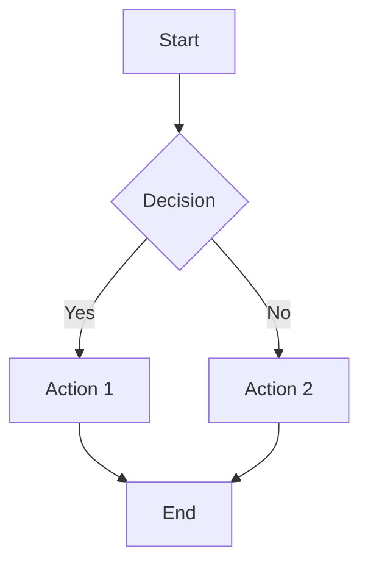
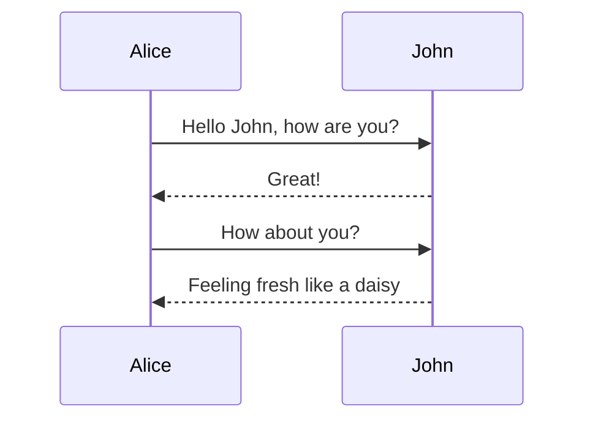
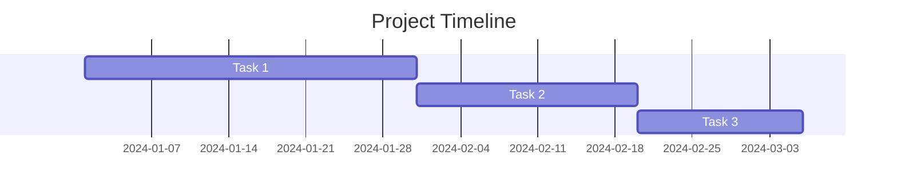

# Mermaid Editor - Quick Start Guide

## 🚀 What's New?

Your portfolio now includes a **professional Mermaid diagram editor** with:

✨ **Key Features:**
- 📐 VS Code-style split-view editor and preview
- 🎨 Real-time diagram rendering
- 💾 Multiple export formats (SVG, PNG, PDF, JSON, Markdown)
- 📱 Fully responsive (desktop, tablet, mobile)
- 🌙 Dark/Light theme support
- ⌨️ Keyboard shortcuts
- 💾 Auto-save to browser storage

## 🎯 Quick Access

### From the Website
1. Visit your portfolio: `https://shuvam-banerji-seal.github.io`
2. Click **"Mermaid"** in the navigation menu
3. Start creating diagrams!

### Direct Link
`https://shuvam-banerji-seal.github.io/pages/mermaid-tool.html`

## 📊 Supported Diagram Types

```
✅ Flowcharts           ✅ Sequence Diagrams    ✅ Class Diagrams
✅ State Diagrams       ✅ ER Diagrams          ✅ Gantt Charts
✅ Pie Charts           ✅ Git Graphs           ✅ Requirement Diagrams
```

## 📤 Export Your Diagrams

Click **Export** button to download as:

| Format | Use Case |
|--------|----------|
| **SVG** | Web, scaling, crisp quality |
| **PNG** | Embedding in documents |
| **PDF** | Sharing, printing |
| **JSON** | Backup, storage |
| **MD** | GitHub, markdown sites |

## ⌨️ Keyboard Shortcuts

| Shortcut | Action |
|----------|--------|
| `Ctrl+K` / `Cmd+K` | Format code |
| `Ctrl+/` / `Cmd+/` | Toggle comment |
| `Ctrl+S` / `Cmd+S` | Save (auto-saved) |
| `Ctrl+Z` / `Cmd+Z` | Undo |

## 📱 On Mobile

- Tap **Editor** or **Preview** tabs to switch views
- Use **menu icon** (☰) for export options
- Full touch optimization for all devices

## 💾 Your Work is Saved

All diagrams automatically save to your browser's local storage. Even if you close the browser, your code will be there when you return!

## 🎨 Example Diagrams

### Flowchart


### Sequence Diagram


### Gantt Chart


## 🔧 Customization

The editor automatically uses your site's theme colors. Diagrams adapt to light/dark mode!

### Change Editor Font Size
Edit `src/mermaid-tool/components/Editor.jsx` → `fontSize` option

### Change Default Diagram
Edit `src/mermaid-tool/App.jsx` → `DEFAULT_CODE`

### Add Custom Styling
Edit `src/mermaid-tool/styles/mermaid-tool.css`

## 📚 Learn More

- [Mermaid.js Documentation](https://mermaid.js.org)
- [Mermaid Syntax Guide](https://mermaid.js.org/syntax/flowchart.html)
- [Official Examples](https://mermaid.js.org/ecosystem/integrations.html)

## 🐛 Troubleshooting

### Diagram won't render?
- Check syntax in error message
- Visit [Mermaid docs](https://mermaid.js.org) for correct syntax
- Clear browser cache: `Ctrl+Shift+R`

### Export not working?
- Ensure diagram renders first (no errors)
- Try exporting as SVG first
- Check browser console for errors (F12)

### Missing from navbar?
- Clear browser cache
- Hard refresh: `Ctrl+Shift+R` (Windows) / `Cmd+Shift+R` (Mac)

## 🚀 Sharing Your Diagrams

1. **Copy the code**: Click the copy button
2. **Share the code**: Send to collaborators
3. **Export as image**: Click Export for PNG/SVG
4. **Export as file**: Download JSON for backup

## 💡 Pro Tips

✨ **Zoom & Pan**
- Scroll to zoom in/out
- Click and drag to pan
- Reset button for quick return

✨ **Code Editing**
- Type normally, diagram updates live
- Press `Ctrl+Z` to undo
- Press `Ctrl+K` to format code

✨ **Theme Switching**
- Click moon/sun icon (top right)
- Diagrams update instantly
- Theme persists across sessions

## 🎓 Common Use Cases

### Software Design
Create system architecture diagrams and flow charts

### Project Planning
Build Gantt charts and timeline visualizations

### Process Documentation
Document workflows and processes

### Database Design
Create ER diagrams for database schemas

### Technical Presentations
Generate diagrams for slides and docs

## 📞 Feedback & Issues

If you encounter any issues or have feature requests:
- Check browser console (F12) for errors
- Visit [GitHub Issues](https://github.com/Shuvam-Banerji-Seal/Shuvam-Banerji-Seal.github.io/issues)
- Share your feedback and suggestions

## 🎉 You're Ready!

Start creating beautiful diagrams right now:
👉 [Open Mermaid Editor](https://shuvam-banerji-seal.github.io/pages/mermaid-tool.html)

---

**Built with ❤️ using React, Vite, and Mermaid.js**

*Last updated: January 2026*
